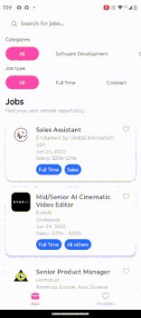
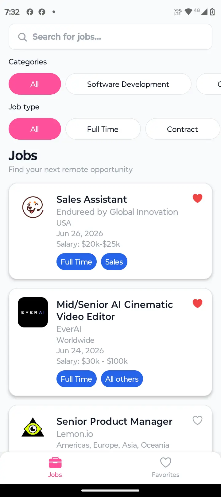
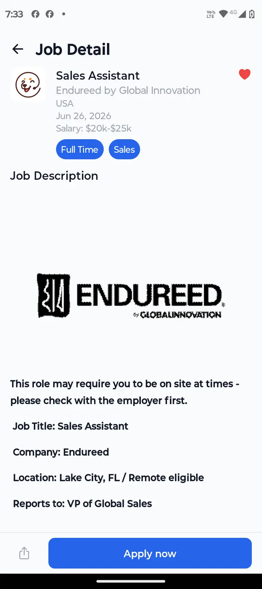
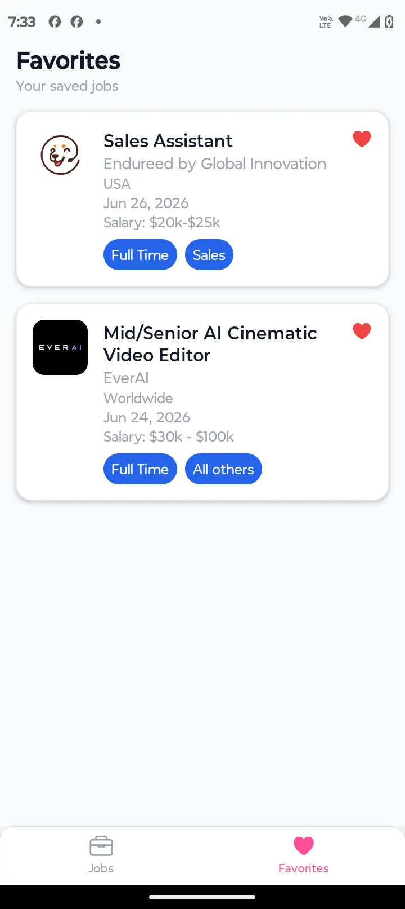
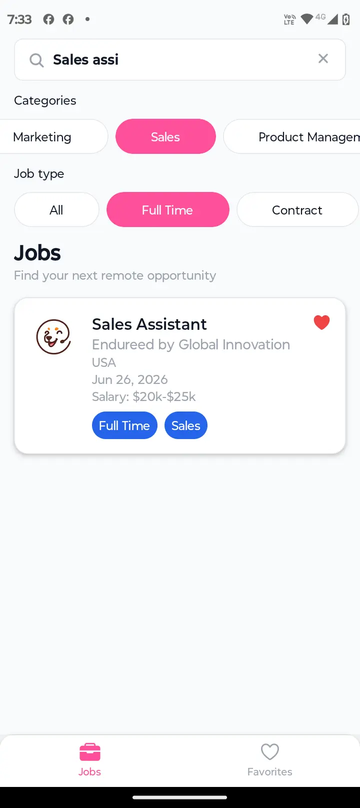

<h1 align="center">TalentHub App</h1>

<p align="center">
A modern mobile application built with <strong>Expo</strong>, <strong>React Native</strong>, <strong>TypeScript</strong> and <strong>Zustand</strong>.
</p>

<p align="center">
React Native Technical Assessment - <strong>Redarbor</strong>
</p>

<p align="center">


</p>

---

# Contents

- Demo
- Highlights
- Screenshots
- Features
- Tech Stack
- API
- Project Structure
- Architecture Decisions
- Requirements
- Getting Started
- Available Scripts
- Future Improvements
- Notes
- License

---

# Demo

The following animation demonstrates the main application flow:

- Browse remote jobs
- Search by title or company
- Filter by category
- Filter by employment type
- View job details
- Save favorites

<p align="center">

</p>

---

# Highlights

- Feature-first architecture
- Reusable design system
- Client-side filtering
- Persistent favorites
- Expo SDK 52
- Zustand state management
- Modular architecture
- Reusable UI components

---

# 📸 Screenshots

| Home                                        | Detail                                        |
| ------------------------------------------- | --------------------------------------------- |
|  |  |

| Favorites                                        | Filters                                        |
| ------------------------------------------------ | ---------------------------------------------- |
|  |  |

---

# Features

## Job Listing

- Browse remote job opportunities
- Search by title and company name
- Filter by category
- Filter by employment type
- Pull-to-refresh
- Loading state
- Error state
- Empty state

## Job Details

- Company logo
- Job title
- Company information
- Candidate location
- Employment type
- Job category
- Salary (when available)
- Publication date
- HTML description rendering
- Share job
- Apply to original job
- Favorite toggle

## Favorites

- Save favorite jobs
- AsyncStorage persistence
- Remove favorites
- Navigate to details
- Empty state

---

# Tech Stack

- Expo SDK 52
- React Native
- TypeScript
- Zustand
- React Navigation
- Expo Image
- AsyncStorage

---

# API

This application consumes the public Remotive API.

Jobs endpoint

https://remotive.com/api/remote-jobs

Categories endpoint

https://remotive.com/api/remote-jobs/categories

---

# 📁 Project Structure

The application follows a feature-first architecture to improve scalability and maintainability.

```text
src
├── app
│   ├── navigation
│   ├── providers
│   └── theme
│
├── features
│   ├── favorites
│   ├── filters
│   ├── job-detail
│   └── jobs
│
└── shared
    ├── components
    ├── constants
    ├── hooks
    ├── services
    ├── types
    └── utils
```

## app

Contains the application's global configuration.

- Navigation
- Providers
- Theme

---

## features

Business logic is organized by feature.

Each feature owns:

- Screens
- Components
- Hooks
- Zustand Store
- Types

Current features

- jobs
- job-detail
- favorites
- filters

---

## shared

Contains reusable code shared across the application.

- Components
- Hooks
- Services
- Utilities
- Types
- Constants

---

# Architecture Decisions

The project was intentionally structured with long-term scalability in mind.

## Feature-first Architecture

Instead of grouping files by technical type, everything is organized by business feature.

Benefits

- Better scalability
- Easier maintenance
- Clear ownership
- Lower coupling

---

## Shared Layer

Only reusable code lives inside `shared`.

Examples

- Button
- Card
- Loader
- Screen
- Badge
- API services
- Utilities
- Types

Feature-specific code remains inside each feature.

---

## Zustand Stores

State is separated by responsibility.

- Jobs Store
- Filters Store
- Favorites Store

Each store manages only its own domain.

---

## Client-side Filtering

Jobs are downloaded only once.

Search, category and employment type filters are applied locally.

Advantages

- Faster UX
- No unnecessary API requests
- Instant filtering

Categories are fetched independently because the API provides a dedicated endpoint.

---

## Design System

A small design system centralizes:

- Colors
- Typography
- Spacing
- Shadows
- Border Radius

Reusable components were built on top of these tokens.

Examples

- Badge
- Button
- Card
- EmptyState
- ErrorView
- FilterChips
- Header
- Loader
- Screen
- SearchInput

---

# Requirements

- Node.js 20+
- npm
- Expo Go (optional)
- Android Studio or Xcode (optional)

---

# Getting Started

## Clone repository

```bash
git clone <repository-url>
cd TalentHub
```

## Install dependencies

```bash
npm install
```

## Configure environment variables

```bash
cp .env.example .env
```

## Start Expo

```bash
npx expo start
```

Run on

- Android Emulator
- iOS Simulator
- Expo Go

## Environment Variables

This project uses environment variables for configuration.

Create a `.env` file in the project root using the provided example:

```bash
cp .env.example .env
```

Or simply duplicate `.env.example` and rename it to `.env`.

Current variables:

```env
EXPO_PUBLIC_API_URL=https://remotive.com/api
```

Expo automatically exposes variables prefixed with `EXPO_PUBLIC_`.

---

# Available Scripts

| Script          | Description         |
| --------------- | ------------------- |
| npm start       | Starts Expo         |
| npm run android | Runs Android        |
| npm run ios     | Runs iOS            |
| npm run lint    | Runs ESLint         |
| npm run format  | Formats the project |

---

# Future Improvements

Possible future enhancements include:

- Infinite pagination
- Offline caching
- Unit testing
- E2E testing
- Accessibility improvements
- Internationalization (i18n)
- Dark mode
- Remote pagination

---

# Notes

This project was developed as part of the Redarbor Frontend Technical Assessment.

Besides implementing the requested features, special attention was given to:

- Clean Architecture
- Reusable Components
- Type-safe Code
- Feature-first Architecture
- Zustand State Management
- Scalable Folder Structure
- Consistent UI Design
- Maintainable Codebase

---

<p align="center">
Built with ❤️ for the Redarbor Technical Assessment.</p>
